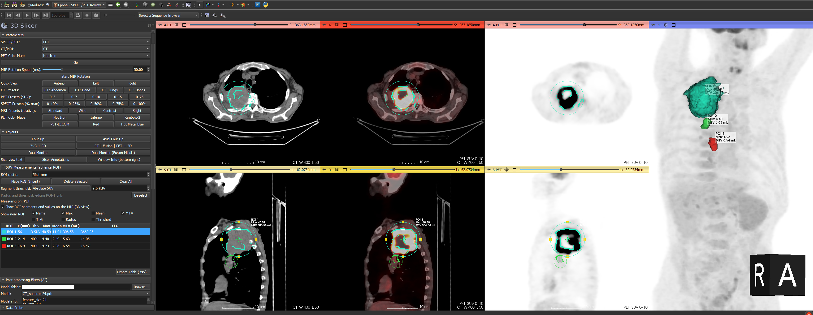

# SlicerPETReviewCompare Extension for 3D Slicer

**Author**: Burak Demir, MD, FEBNM  
**Module versions**: Epona – SPECT/PET Review (EasyFusion) alpha v1.0  
**Contact**: 4burakfe@gmail.com

## Overview

SlicerPETReviewCompare is a 3D Slicer extension for reading SPECT/PET with CT/MRI. The tools are developed with research utility in mind and are **not intended for clinical use**.

In Slicer the modules appear under the **Nuclear Medicine** category as:

| Folder | Module name in Slicer |
|---|---|
| `Easy_fusion` | Epona – SPECT/PET Review |
| `EponaCompare` | Epona – SPECT/PET Compare (in development) |

> Epona was previously part of the [SlicerPETDenoise](https://github.com/4burakfe/SlicerPETDenoise) extension. It now lives here; the denoising (Belenos – PET Denoise) and comparison (Belenos – Volume Comparator) modules remain in SlicerPETDenoise. Scenes, ROIs and settings saved with the earlier version load unchanged.

You can test the module with the cases here: https://github.com/4burakfe/SlicerPETDenoise_SampleCases/releases/tag/images

---

## Modules

### 1. Epona – SPECT/PET Review (EasyFusion)

#### Purpose
A reading environment for SPECT/PET with CT/MRI: fusion, MIP, reading layouts, windowing presets, SUV measurements with spherical ROIs, and optional AI post-processing filters.

#### Fusion and MIP
- Select the SPECT/PET and CT/MRI volumes, choose a color map and click **Go** to set up fusion and the 3D MIP. If the current layout is not one of Epona's, **Go** switches to **CT | Fusion | PET + 3D**. After the first **Go**, changing either volume updates the views immediately.
- MIP rotation with adjustable speed, and quick views (Anterior, Left, Right). Rotation no longer starts on its own after loading a scene.
- PET color maps: Hot Iron, Inferno, Rainbow-2, PET-DICOM, Red, Hot Metal Blue.

#### Windowing presets and keyboard shortcuts
- **CT**: Abdomen, Head, Lungs, Bones
- **PET (SUV)**: 0–5, 0–7, 0–10, 0–15, 0–25
- **SPECT (% of max)**: 0–10 / 25 / 50 / 75 / 100 % of the maximum count
- **MRI (relative)**: Standard, Wide, Contrast, Bright — percentile windows computed on tissue voxels (air / background excluded), for MRI or any image without absolute units
- With the mouse over a view, **F5–F9** apply the presets for that view: CT presets on CT views (or MRI presets when the volume is an MRI), SUV presets on fusion, PET-only and 3D views. Shortcuts also work in the second-monitor window.

#### SUV, Bq/mL or counts?
Epona works out what the SPECT/PET voxel values are and shows a unit only when it is sure. It checks, in this order:
1. The voxel value units of the volume (set, for example, by the **PET DICOM** extension when it converts PET to SUVbw), or the unit recorded by Epona on an AI-filtered volume (the same as its source).
2. The DICOM header of the files the volume was loaded from, if they are still in Slicer's DICOM database: Units BQML → Bq/mL, CNTS → counts, GML → SUV; a SPECT (NM) with whole-number values → counts.
3. For SUV only: "SUV" in the name, or mostly fractional values within the SUV range (99.9th percentile 0.3–100). This lets SUV volumes saved as plain `.nrrd` (which keeps no units) still be recognized.

Claims that clearly contradict the values (an "SUV" volume in the thousands, or "Bq/mL" that stays tiny) are rejected. Bq/mL and counts are never guessed from the values alone. The result and its source are shown under **Measuring on**.

- **Start window**: SUV 0–10 only for a volume known to be in SUV; otherwise 0–100 % of the maximum. When you switch to another SPECT/PET, the window is kept only if it suits the new volume (both SUV, or the same kind with a similar maximum).
- **F5–F9** over fusion, PET and 3D views give the SUV presets for SUV volumes, and 10 / 25 / 50 / 75 / 100 % of the maximum otherwise.
- The measurement panel, ROI labels and exported table use the unit only when it is known (`SUVmax` columns for SUV; neutral `Max` / `Mean` names and a **Value unit** column otherwise).

#### Layouts
- **Four-Up**: axial, sagittal and coronal fusion + 3D MIP
- **Axial Four-Up**: axial fusion | 3D MIP over axial CT | axial PET
- **2×2 + 3D**: fusion and CT (axial, sagittal) with the MIP on the right
- **CT | Fusion | PET + 3D**: axial and sagittal CT, fusion and PET side by side with the MIP
- **Dual Monitor** and **Dual Monitor (Fusion Middle)**: 3×2 slice views on monitor 1, 3D MIP + coronal fusion + coronal CT in a separate window for monitor 2 (requires Slicer 5.2 or later; click again to bring the second window back if it was closed)

PET-only views are shown in inverted grey. Window / level changes stay synchronized between fusion and PET-only views.

**Go** and every layout switch fit the slice views to the volumes (dual monitor layouts once more after the Monitor 2 window is placed). A view left stretched by a layout switch (its field of view no longer matching its shape) is corrected automatically, keeping its zoom; after loading a scene the saved zoom is kept.

Views of the same orientation stay together: scrolling, panning or zooming the axial fusion moves the axial CT and axial PET views too (and the same for sagittal and coronal), as in Compare. The fusion view is the reference. Turn it off with **Keep same-orientation views together** in the Layouts section. A view turned to another orientation with its view controller is left alone.

The volume selector labels follow what is selected: **PET** or **SPECT** (from DICOM, units, the data tree or the name) and **CT** or **MRI** (from DICOM, else the voxel values: a CT has air far below 0 HU); they read **SPECT/PET** / **CT/MRI** when it is not known. The same in Compare.

#### Toolbar
While the module is open, a row of small picture buttons appears at the top of the window (and disappears when you go to another module):
- copies of the volume selectors (choosing there is the same as in the panel; labelled PET / SPECT and CT / MRI as detected) and **Go**,
- **window presets** as pictures of what they look like: CT (abdomen, head, lungs, bones) or MRI presets, and SUV (0–5 … 0–25) or % of maximum presets — only the ones that fit the selected volumes are shown,
- **color maps** as color bars, **layouts** as small pictures of the views (the name shows when you hover),
- **MIP rotation** on / off and quick views **A** (anterior), **L** (left), **R** (right),
- **hide the module panel** (it always comes back when you leave the module) and **hide the toolbar** (bring it back with the **Show Toolbar** button under Go; the setting is shared with Compare).

ROIs and AI filters stay in the module panel.

#### Slice view text
- **Slicer Annotations**: shows or hides Slicer's own corner annotations; the previously active corners are restored when turned back on.
- **Window Info (bottom right)**: shows the current CT/MRI window / level and SPECT/PET range (in SUV for PET) in each slice view, following presets, shortcuts and mouse drags.

#### SUV measurements (spherical ROIs)
- Place an ROI with **Place ROI** or by pressing **Insert** over a slice view. Drag the center to move it and the yellow edge handles to resize it.
- Each ROI reports sphere **Max** and a thresholded segment giving segment **Mean**, **MTV** (mL) and **TLG**. The threshold is either % of the ROI's Max (default 40 %) or an absolute SUV (default 2.5), and each ROI keeps its own radius and threshold.
- Select a row in the table to jump to that ROI and edit it; **Deselect** returns the controls to the defaults for new ROIs.
- Choose which values are shown next to each ROI (Name, Max, Mean, MTV, TLG, Radius, Threshold).
- Segments and values can be shown on top of the MIP (display only, nothing is added to the scene).
- **Export Table (.tsv)** saves all ROIs at full precision with ROI centers, statistics, threshold and the source PET volume.
- ROIs, segments and their settings are saved with the scene and restored when it is reloaded.

> Values are read directly from the selected SPECT/PET volume; they are SUV only if the volume is in SUV (see *SUV, Bq/mL or counts?*). Load PET with the **PET DICOM** extension to get SUV.

#### Post-processing filters (AI)
- Runs Belenos PET Denoise models (`.pth` + `.txt`) directly from the review module on either the SPECT/PET or the CT/MRI volume (the target is guessed from the model's `.txt` file or name and can be changed). Dual-channel models are supported.
- **No model folder needed**: the published denoising and super-resolution models ([Models](https://github.com/4burakfe/SlicerPETDenoise/releases/tag/Models), [SuperRes_Models](https://github.com/4burakfe/SlicerPETDenoise/releases/tag/SuperRes_Models)) are listed right away. The first time one is applied it is downloaded from GitHub (with progress and Cancel, checksum-verified) into Slicer's cache folder (`BelenosModels`) and reused from then on. GitHub is checked at most once a day for new or updated models; **↻** checks now.
- **Own models** (optional): choose a folder with your own `.pth` + `.txt` models; they are listed after the published ones. Copies of the published models already in that folder are used without downloading.
- **Limit to ROI** crops to an adjustable box before filtering, which is much faster and needs far less memory; volumes under non-linear transforms are handled too.
- A confirmation dialog shows the model and estimated job size before running, and the run can be cancelled.
- The result is always a **new volume**; the original is never changed. Views, MIP and SUV ROIs switch to the filtered volume.
- **Force CPU** option; missing packages (`monai`, `einops`) are offered for installation, and PyTorch can be installed via PyTorch Utils when needed.

> Note: SUVs measured on a filtered volume differ from those of the original.

#### How to Use
1. Load the SPECT/PET and CT/MRI volumes and select them in the panel.
2. Choose a color map and click **Go**.
3. Pick a layout, then use the presets or F5–F9 for windowing.
4. Place ROIs with **Insert** for SUV measurements and export the table if needed.
5. (Optional) Open **Post-processing Filters (AI)** to denoise or enhance a volume.

> Note: Apart from AI filters (which create new volumes), this module only affects visualization, not image content.

---

### 2. Epona – SPECT/PET Compare (in development)

Reads two studies of the same patient (time point 1 and time point 2). Folder `EponaCompare`; it uses the shared `EponaLib` code of Epona, so both modules are installed together.

#### Registration (time point 1 → time point 2)
1. Select the SPECT/PET and CT/MRI of both time points.
2. Press **Register**. The view switches to axial | coronal | sagittal CT/MRI fusions (time point 2 in grey, time point 1 tinted on top).
3. Time point 1 is moved onto time point 2 by a **shift only (no rotation)**:
   - **Initial alignment**: the top of the body is matched (PET/CT is acquired vertex to mid-thigh or whole body) and the body is centred right–left and front–back over the length both scans cover. Thin structures such as the CT table and head holder are ignored.
   - **Refinement**: a fast mutual-information registration of the shift on ~4 mm copies of the CT/MR images (works for CT–CT and MR–CT). It is kept only if it improves the match.
4. Time point 1's SPECT/PET moves with its CT/MRI (the shift is applied above any transform it already has), so its own PET/CT alignment is kept. The shift is stored in the transform **TP1 to TP2 (Epona registration)**, and is saved with the scene. **Reset** puts time point 1 back in its original position; **Show Check Views** shows the fusions again.
5. **Manual adjustment**: R / A / S knobs show the total shift of time point 1 and move it in 0.5 mm steps (arrows or mouse wheel on the number; the slider covers ±50 mm around the automatic result). **Move handles in the views** adds drag handles (shift only, no rotation) to the check views. **Time point 1 opacity** fades the overlay in and out to check edges. **Back to automatic** undoes the manual changes. Knobs, handles, Register and the Transforms module all change the same transform and stay in sync; the knobs also work without registering first.

#### Reading (after **Accept Registration → Compare**)
When the fusions match, press **Accept Registration → Compare**. Time point 1's SPECT/PET stays attached to the registration, both time points get their first display (CT abdomen window; SPECT/PET SUV 0–10 when it is known to be SUV, otherwise 0–100 % of its maximum) and the reading layout opens. Volume selectors, table tabs and view headers show each study's imaging date and time in parentheses, e.g. `PET WB (2026-03-14 10:32)` (taken from DICOM acquisition / series / study date and time, else from a date in the volume name).

Layouts (3 columns × 2 rows; **time point 1 top row (blue), time point 2 bottom row (orange)**):

| Layout | Columns |
|---|---|
| Axial Fusion \| CT + MIP | axial fusion \| axial CT/MRI \| MIP |
| Axial Fusion \| PET + MIP | axial fusion \| axial PET (inverted grey) \| MIP |
| Axial \| Coronal Fusion + MIP | axial fusion \| coronal fusion \| MIP |
| Dual Monitor | monitor 1: axial CT/MRI \| axial fusion \| axial PET — monitor 2 (separate window): MIP \| coronal fusion \| coronal PET |

- Slice views of the same orientation scroll, pan and zoom together (time point 2's fusion view leads).
- **Same window for both time points**: CT/MRI windows are linked, and SPECT/PET windows too when both are in SUV (other units keep their own windows). Color maps, CT / SUV / % presets, F5–F9 (with the mouse over a compare view), MIP rotation and quick views work as in Epona.
- **Measurements**: each time point has its own spherical ROIs, segmentation and table (one tab per time point, labelled with its imaging time). Press **Insert** over a view of a time point to place an ROI there, or use **Place ROI** for the selected tab. Time point 1's ROIs move with the registration. Each table exports to TSV.
- The reading is saved with the scene and restored on loading (the PET-only views are rebuilt).
- **Toolbar** (top of the window while the module is open, like Epona's): the four volume selectors (time point 1 in blue, time point 2 in orange, with imaging times), CT and SUV / % presets for both time points, color maps, the compare layouts, MIP rotation and quick views (A / L / R), hide the panel, hide the toolbar (the **Show Toolbar** button under the time point selectors brings it back). Registration and ROIs stay in the panel.
- Not in Compare yet: AI filters and MRI window presets (use Epona for these).

---

## Installation

### From the Extensions Manager (recommended)

1. Install [3D Slicer](https://www.slicer.org/) (5.2 or later is needed for the dual monitor layouts).
2. Open **View → Extensions Manager** (or the Extensions Manager icon in the toolbar).
3. Search for **PETReviewCompare** and click **Install**.
4. Restart Slicer when prompted. The module appears under the **Nuclear Medicine** category.

> If you had installed an older version of **PETDenoise** that still contained Epona, update PETDenoise as well, so that the module is not installed twice.

### Manual installation (latest development version)

1. Clone or download this repository and extract the zip folder.
2. In 3D Slicer go to **Edit → Application Settings → Modules → Additional Module Paths**.
3. Click the **>>** button and add the `Easy_fusion` and `EponaCompare` folders (the shared `EponaLib` package inside `Easy_fusion` is found automatically).
4. Restart Slicer.

### Code layout and tests (for development)

`Easy_fusion/Easy_fusion.py` holds the module, its panel and the fusion / MIP logic; `EponaCompare/EponaCompare.py` holds the compare module. Code they share lives in `Easy_fusion/EponaLib/`:

| File | Contents |
|---|---|
| `scene.py` | scene loading / closing state, run code once the scene has settled |
| `shortcuts.py` | F5–F9 / Insert shared by both modules (the module whose views are under the mouse takes the key) |
| `layouts.py` | layout IDs and XML (Epona and compare), slice view roles, screens |
| `values.py` | SUV / Bq/mL / counts detection, window presets and window math |
| `studyinfo.py` | imaging date / time of a volume (DICOM, Data module tree, name) |
| `display.py` | window / level sync and links between volumes, slice geometry sync, Hot Iron colors |
| `roi.py` | spherical ROI statistics, thresholds, labels, table / TSV export |
| `roiset.py` | a set of spherical ROIs with its own handles, labels, segmentation and views (Epona's SUV ROIs, and one per compare time point) |
| `filters.py` | AI filters: model catalog and downloads, inference |
| `overlays.py` | window info in the slice views, ROI values on the MIP |
| `registration.py` | time point 1 → 2 translation registration, transform handling |
| `compareviews.py` | compare views: PET-only twins, view contents, MIPs per time point, Monitor 2 window |
| `toolbar.py` | the module toolbar: picture buttons (icons in `Easy_fusion/Resources/Icons/Toolbar`), color bars, hiding the panel |
| `tests.py` | unit tests of the scene-free helpers above |

In developer mode, **Reload** also reloads `EponaLib`, and **Reload and Test** runs the unit tests (the open scene is not cleared). Outside Slicer: `cd Easy_fusion && python -m unittest EponaLib.tests -v` (needs numpy).

---

## Dependencies

Epona – SPECT/PET Review works without any extra packages. Only the optional **AI post-processing filters** need:
- `torch` — install the **PyTorch** extension from the Extensions Manager, then use the **PyTorch Utils** module to install PyTorch with the CUDA build matching your GPU (or CPU only). The module offers to open PyTorch Utils when PyTorch is missing.
- `monai`, `einops` — offered for installation automatically when first needed.

The filters use models trained for **Belenos – PET Denoise** (`.pth` + `.txt`):
- Published models (downloaded automatically on first use, internet access needed once per model): [denoising](https://github.com/4burakfe/SlicerPETDenoise/releases/tag/Models), [super-resolution](https://github.com/4burakfe/SlicerPETDenoise/releases/tag/SuperRes_Models)
- Train your own: https://github.com/4burakfe/Claritas

Offline computers: download the `.pth` and `.txt` files from the release pages yourself and choose their folder as **Own models**. If the [SlicerPETDenoise](https://github.com/4burakfe/SlicerPETDenoise) extension is installed, the model folder last used there is used as the own-models folder until you choose another.

A CUDA-capable GPU with a CUDA-enabled PyTorch build is highly recommended for the AI filters.
